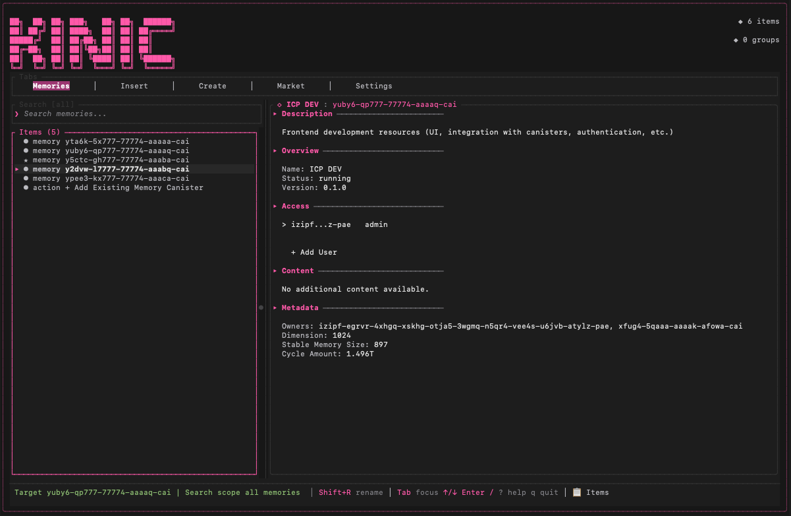
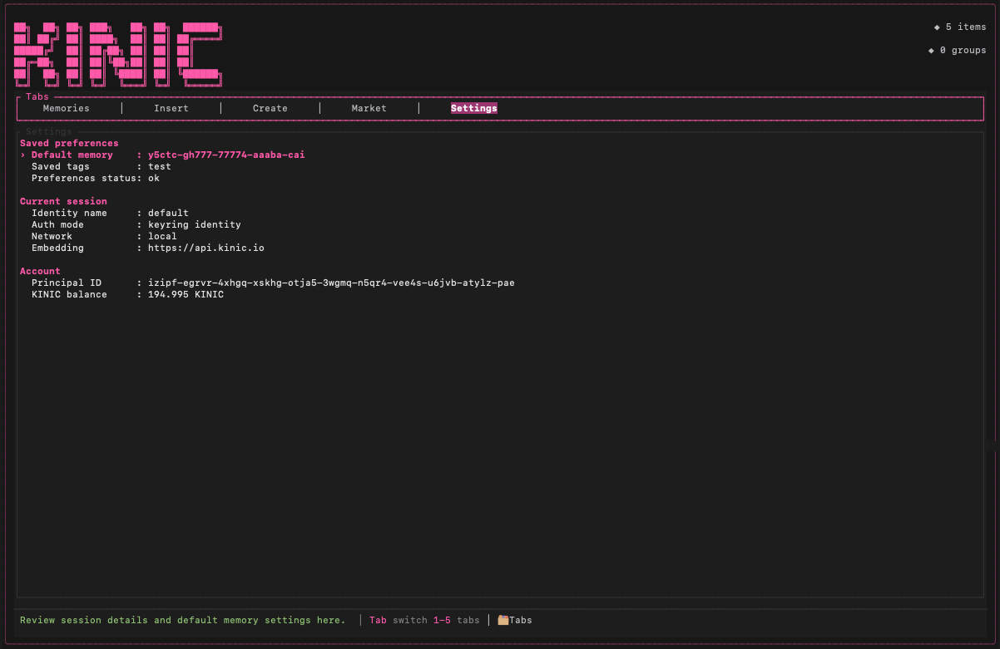
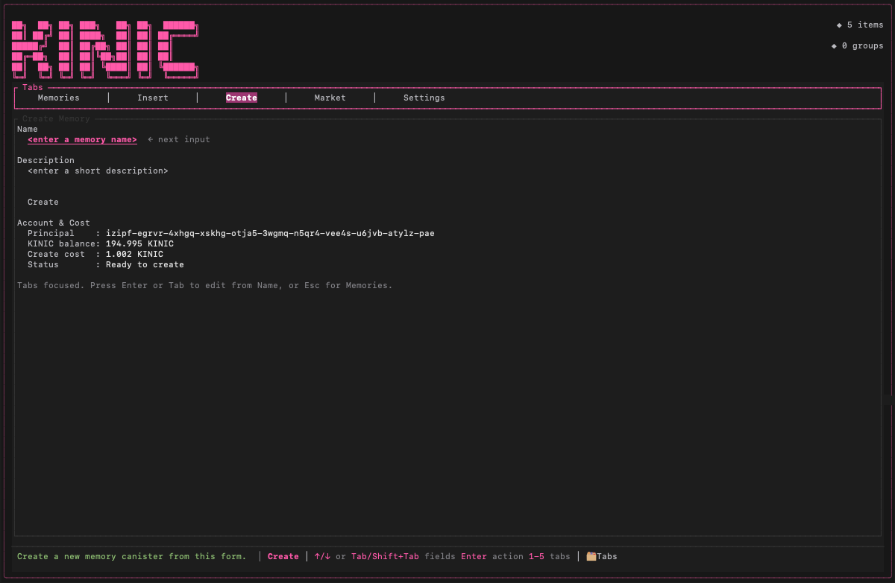

#  Kinic CLI - Trustless Agentic Memory

**OPEN BETA v0.1** - star, share, and provide feedback :)

Python bindings for the Kinic CLI core, enabling you to build AI agents with verifiable, owned memory on the Internet Computer. Give your agents the memory they can prove, own, and carry anywhere.

**For the wizards building trustless agents** - no more lobotomized summons that reset on every quest.

Looking for the docs? See `docs/cli.md` for the command-line interface and `docs/tui.md` for the terminal UI.

Made with ❤️ by [ICME Labs](https://blog.icme.io/).


---

## What is Trustless Agentic Memory?

Traditional AI agents face three critical problems:

1. **Memory Without Proof**: TEEs prove computation, but can't verify the memories your agent retrieved were correct.
2. **Memory Without Ownership**: Your agent's identity is onchain, but its memories live in Pinecone, Weaviate, or other centralized providers.
3. **Payment Without Verification**: With x402, agents can pay for memory retrieval - but can't prove they received the right results.

Kinic solves this with **zkTAM** (zero-knowledge Trustless Agentic Memory):
- ✅ **Verifiable**: zkML proofs for embeddings - no black box vectors
- ✅ **Owned**: Your memory lives on-chain in WASM canisters you control
- ✅ **Portable**: Move your agent's memory between any infrastructure

By default we use the Internet Computer as the DA layer—with VetKey encryption and cross-chain signing (tECDSA). You can run it locally or on any WASM-based DA layer. In future versions, full zkML support will be enabled, allowing for trustless verification on nearly all blockchains.

---

## Prerequisites

- **dfx 0.31+**
- **dfx identity**: Create or select a named identity with `dfx identity new <name>` or `dfx identity use <name>`
- **KINIC tokens**: Have KINIC ready if you plan to create memories
- **yazi**: Required only if you want to use the file chooser in TUI `File` mode
- **pdftotext**: Required only if you want to insert PDFs

> Note: Do not use the `default` identity with `kinic-cli`—it always fails. Use a named identity instead.

On macOS, the PEM for the dfx identity you use with `--identity` must be stored in Keychain.

When using a local environment, make sure the local replica and supporting canisters are already running.

Optional local setup: if you need local launcher, ledger, or II canisters, run `./scripts/setup.sh` after `dfx start --clean --background`.

---

## Terminal UI Quickstart

Kinic TUI is a terminal UI for operating Kinic memory canisters. It lets you handle `list`, `search`, `create`, `insert`, and settings changes from one screen, so you do not need to remember every subcommand each time.

Follow this flow once from start to finish:

1. Start the TUI
2. Confirm your identity and balance
3. Create one memory
4. Insert a short string
5. Search for that content

> Operate Kinic memories from one terminal screen. Create a memory, insert text or files, search for content, and use chat without leaving the UI.

### Install and Launch

Kinic TUI is included in `kinic-cli`. For OSS users, the usual path is to download a release binary and run it directly, or start it from source during development.

Mainnet:

```bash
kinic-cli --identity alice --ic tui
```

Local replica:

```bash
kinic-cli --identity alice tui
```

From source:

```bash
cargo run -- --identity alice --ic tui
```

First-run notes:

- `--identity` is required
- `--ii` is not supported yet
- on macOS, you may be asked to allow Keychain access
- the TUI opens on the `Memories` tab first
- `File` mode requires `yazi` for the chooser, but manual path input still works without it

Install `yazi` on macOS:

```bash
brew install yazi
```

If you also want to try PDF insertion:

```bash
brew install poppler
```

---

### Quick Path

1. Start the TUI
2. In `Settings`, confirm `Principal ID` and `KINIC balance`
3. In `Create`, create one memory
4. In `Insert`, add a short string
5. In `Memories`, search for that string

For the fastest first success, start with `Inline Text`. It avoids file chooser and PDF conversion setup.

### Step 1: Start the TUI and Learn the Layout

When the TUI starts, it opens on the `Memories` tab. Use `1` to `5` to switch tabs, `Tab` / `Shift+Tab` to move focus, and `?` to open help. In normal list navigation, `q` quits and `Ctrl+R` refreshes the current view.



What to understand first:

- `Memories`: list, search, detail view, and chat
- `Insert`: add files, text, or manual embeddings
- `Create`: create a new memory
- `Market`: reserved and not implemented yet
- `Settings`: principal, balance, default memory, saved tags, and retrieval settings

### Step 2: Confirm Identity and Balance

Open `Settings` and confirm that `Principal ID` matches the identity you launched with. Then check whether `KINIC balance` is high enough to create a memory. If needed, you can transfer tokens from the transfer modal, and `Ctrl+R` refreshes both `Principal ID` and `KINIC balance`.



Quick checklist:

1. Open `Settings`
2. Read `Principal ID`
3. Confirm `Identity name`
4. Confirm `Network`
5. Press `Ctrl+R` if the balance looks stale

Main items shown in this tab:

- `Principal ID`
- `KINIC balance`
- `Default memory`
- `Saved tags`
- `Embedding API endpoint`
- `Identity name`
- `Auth mode`
- `Network`

### Step 3: Create Your First Memory

Move to `Create`, enter a short name and description, and submit. This screen also shows the current principal, current balance, and required creation cost, so you can catch funding issues before submission. If the balance is insufficient or retrieval fails, a message appears immediately.



Walkthrough:

1. Press `3` or `Ctrl+N` to open `Create`
2. Enter `Name`
3. Enter `Description`
4. Move to `Submit` and press `Enter`
5. Return to `Memories` and confirm that the new memory appears in the list

### Step 4: Insert Something Small First

For the first run, `Inline Text` is the easiest choice. It avoids file chooser setup and PDF conversion. `Inline Text` supports multiple lines and works well for short notes or test data.


Walkthrough:

1. Open `Insert`
2. Set `Mode` to `Inline Text`
3. Leave `Memory ID` empty if you already set a default memory, or paste the memory id if you did not
4. Enter a simple `Tag`, for example `hello`
5. Enter a short unique string that will be easy to search for
6. Submit

Shared fields in the `Insert` tab:

- `Mode`: insertion method
- `Memory ID`: target memory
- `Tag`: tag to save with the content
- `Submit`: run the insertion

Notes:

- if `Memory ID` is empty and a default memory is already set, that value appears as a placeholder candidate
- `File` mode supports `md`, `markdown`, `mdx`, `txt`, `json`, `yaml`, `yml`, `csv`, `log`, and `pdf`
- `Manual Embedding` mode accepts `Text` plus an `Embedding` in JSON array format

Example text:

```text
Kinic TUI smoke test: mango-orbit-314
```

#### Optional Next Step: File and PDF

File mode:

- open the picker with `yazi`, or type the path directly
- a good second step after inline text
- manual `FilePath` input still works even if `yazi` is not installed

PDF mode:

- PDFs are converted to Markdown before insertion
- `pdftotext` is required
- PDF insertion fails if `pdftotext` is not available

### Step 5: Search for What You Inserted

Return to `Memories`, select the target memory, switch the search scope to `selected memory`, and search for the unique text you just inserted. Press `Enter` to open the result details, and `Esc` to return to the list.

Walkthrough:

1. Open `Memories`
2. Select the memory you just created
3. Set the scope to `selected memory`
4. Search for the exact text you inserted
5. Press `Enter` on the result to open the details

Notes:

- switch search scope with `←` `→`
- `all memories` searches across every memory
- `selected memory` searches only within the currently selected memory
- if you want to search inside one memory, it is easiest to select that memory first and then search

### Step 6: Try Chat If You Want

After you confirm search works, you can try chat from the `Memories` tab. Press `Shift+C` to open the chat panel. Start with the selected memory, then switch to `all memories` if needed. Press `Shift+N` to start a new empty thread for the current chat context.

Current behavior:

- chat can target either the selected memory or all searchable memories
- the TUI restores the last used thread for each selected memory and for `all memories`
- v1 does not have a thread list yet, so you cannot reopen older threads from the UI
- existing saved chat history is not migrated; the TUI starts from the new thread store file

### Keyboard Cheat Sheet

| Key | Action |
| --- | --- |
| `1` to `5` | Switch tabs |
| `Tab` / `Shift+Tab` | Move focus |
| `↑` / `↓` | Move through lists and fields |
| `Enter` | Open, confirm, submit |
| `Esc` | Go back or close |
| `?` | Show help |
| `q` | Quit |
| `Ctrl+N` | Open `Create` |
| `Ctrl+R` | Refresh the current view |
| `Shift+C` | Toggle the chat panel |
| `Shift+D` | Set the selected memory as default |

### Common Next Steps

- set a default memory
- insert a file
- insert a PDF
- reuse saved tags
- rename a memory
- add an existing memory canister
- tune chat retrieval settings

For more detail, see `docs/tui.md`.

---

# Direct CLI and Python Usage

If you want to work directly with Kinic from the command line or from Python, use the setup below instead of the TUI flow. This path is useful when you want to script memory operations, integrate Kinic into an agent, or call the library from your own application.

### Python Library

From PyPI:

```bash
pip install kinic-py

# Or with uv
uv pip install kinic-py
```

From source:

Requires Rust toolchain for the PyO3 extension.

```bash
pip install -e .

# Or with uv
uv pip install -e .
```

### Direct CLI and Python Quickstart

#### 1. Create or Select Your Identity

Create or switch to a named dfx identity before using the CLI or Python library:

```bash
dfx identity new <name>
# or if you have already created it
dfx identity use <name>
```

#### 2. Check Your Balance

Make sure you have at least 1 KINIC token:

```bash
# Get your principal
dfx --identity <name> identity get-principal

# Check balance (result is in base units: 100000000 = 1 KINIC)
dfx canister --ic call 73mez-iiaaa-aaaaq-aaasq-cai icrc1_balance_of '(record {owner = principal "<your principal>"; subaccount = null; }, )'

# Example: (100000000 : nat) == 1 KINIC
```

**DM https://x.com/wyatt_benno for KINIC prod tokens** with your principal ID.

Or purchase them from MEXC or swap at https://app.icpswap.com/ .

#### 3. Internet Identity Flow (`--ii`, CLI only)

If you prefer browser login instead of a Keychain-backed dfx identity:

```bash
cargo run -- --ii login
cargo run -- --ii list
```

Delegations are stored at `~/.config/kinic/identity.json` with a default TTL of 6 hours.
The login flow uses a local callback on port `8620`.

#### 4. Deploy and Use Memory from Python

```python
from kinic_py import KinicMemories

km = KinicMemories("<identity name>")  # use ic=True for mainnet, e.g. KinicMemories("<name>", ic=True)
memory_id = km.create("Python demo", "Created via kinic_py")
tag = "notes"
markdown = "# Hello Kinic!\n\nInserted from Python."

km.insert_markdown(memory_id, tag, markdown)

for score, payload in km.search(memory_id, "Hello"):
    print(f"{score:.4f} -> {payload}")
```

For external agent runtimes such as n8n and LM Studio using local MCP, see [docs/external-tools.md](docs/external-tools.md). That guide now covers the six exposed tools, how `KINIC_TOOL_IDENTITY` and `KINIC_TOOL_NETWORK=local|mainnet` select the fixed MCP identity, when Keychain approval appears, how to pin the identity in LM Studio or n8n startup configuration, and why `tools serve` is env-only rather than driven by CLI global flags.

You can tag inserted content such as `notes` or `summary_q1` and manage it later by tag.

---

## Insert a PDF

Python (preferred: `insert_pdf_file`):
```python
num_chunks = km.insert_pdf_file(memory_id, "quarterly_report", "./docs/report.pdf")
print(f"Inserted {num_chunks} PDF chunks")
```

The deprecated `insert_pdf(...)` alias still works, but `insert_pdf_file(...)` is the canonical API.

See `python/examples/insert_pdf_file.py` for a runnable script.

---

## Ask AI

Runs a search and prepares context for an AI answer. The CLI calls `/chat` at `EMBEDDING_API_ENDPOINT` (default `https://api.kinic.io`) and prints only the `<answer>` text.

```python
prompt, answer = km.ask_ai(memory_id, "What did we say about quarterly goals?", top_k=3, language="en")
print("Prompt:\n", prompt)
print("Answer:\n", answer)
```

- `km.ask_ai` returns `(prompt, answer)` where `answer` is the `<answer>` section from the chat response.
- CLI usage: `cargo run -- --identity <name> ask-ai --memory-id <id> --query "<q>" --top-k 3`

---

## Configure memory visibility

You can control who can read or write a memory canister—either everyone (`anonymous`) or specific principals—and assign `reader` or `writer` roles.

Python example:
```python
from kinic_py import KinicMemories

km = KinicMemories("<identity>")

# Grant reader access to everyone (anonymous)
km.add_user("<memory canister id>", "anonymous", "reader")

# Grant writer access to a specific principal
km.add_user("<memory canister id>", "w7x7r-cok77-7x4qo-hqaaa-aaaaa-b", "writer")
```

CLI example:
```bash
# Give everyone reader access
cargo run -- --identity <name> config users add \
  --memory-id <memory canister id> \
  --principal anonymous \
  --role reader

# Grant writer access to a specific principal
cargo run -- --identity <name> config users add \
  --memory-id <memory canister id> \
  --principal w7x7r-cok77-7x4qo-hqaaa-aaaaa-b \
  --role writer
```

Notes:
- `anonymous` applies to everyone; admin cannot be granted to anonymous.
- Roles: `admin` (1), `writer` (2), `reader` (3).
- Principals are validated; invalid text fails fast.

---

## Update a memory canister (CLI)

Trigger the launcher’s `update_instance` for a given memory id:
```bash
cargo run -- --identity <name> update \
  --memory-id <memory canister id>
```

## Check token balance (CLI)

Query the ledger for the current identity’s balance (base units):
```bash
cargo run -- --identity <name> balance
```

---

## API Reference

### Class: `KinicMemories`

Stateful helper that mirrors the CLI behavior.
```python
KinicMemories(identity: str, ic: bool = False)
```

**Parameters:**
- `identity`: Your dfx identity name
- `ic`: Set `True` to target mainnet (default: `False` for local)

### Methods

#### `create(name: str, description: str) -> str`
Deploy a new memory canister.

**Returns:** Canister principal (memory_id)

#### `list() -> List[str]`
List all memory canisters owned by your identity.

#### `insert_markdown(memory_id: str, tag: str, text: str) -> int`
Embed and store markdown text with zkML verification.

**Returns:** Number of chunks inserted

#### `insert_markdown_file(memory_id: str, tag: str, path: str) -> int`
Embed and store markdown from a file.

**Returns:** Number of chunks inserted

#### `insert_pdf_file(memory_id: str, tag: str, path: str) -> int`
Convert a PDF to markdown and insert it.

**Returns:** Number of chunks inserted

#### `search(memory_id: str, query: str) -> List[Tuple[float, str]]`
Search memories with semantic similarity.

**Returns:** List of `(score, payload)` tuples sorted by relevance

#### `ask_ai(memory_id: str, query: str, top_k: int | None = None, language: str | None = None) -> Tuple[str, str]`
Run the Ask AI flow: search, build an LLM prompt, and return `(prompt, answer)` where `answer` is the `<answer>` section from the chat endpoint.

**Parameters:** `top_k` (defaults to 5), `language` code (e.g., `"en"`)

#### `balance() -> Tuple[int, float]`
Return the current identity’s balance as `(base_units, kinic)`.

#### `update(memory_id: str) -> None`
Trigger `update_instance` via the launcher for the given memory canister.

### Module-Level Functions

Stateless alternatives available:
- `create_memory(identity, name, description, ic=False)`
- `list_memories(identity, ic=False)`
- `insert_markdown(identity, memory_id, tag, text, ic=False)`
- `insert_markdown_file(identity, memory_id, tag, path, ic=False)`
- `insert_pdf_file(identity, memory_id, tag, path, ic=False)`
- `insert_pdf(identity, memory_id, tag, path, ic=False)`
- `search_memories(identity, memory_id, query, ic=False)`
- `ask_ai(identity, memory_id, query, top_k=None, language=None, ic=False)`
- `get_balance(identity, ic=False)`
- `update_instance(identity, memory_id, ic=False)`

---

## Example: Full Demo Script

Run the complete example at `python/examples/memories_demo.py`:
```bash
# With existing memory
uv run python python/examples/memories_demo.py \
  --identity <name> \
  --memory-id <memory canister id>

# Deploy new memory
uv run python python/examples/memories_demo.py --identity <name>

# Use mainnet
uv run python python/examples/memories_demo.py --identity <name> --ic
```

Ask AI example at `python/examples/ask_ai.py`:
```bash
uv run python python/examples/ask_ai.py \
  --identity <name> \
  --memory-id <memory canister id> \
  --query "What is xxxx?" \
  --top-k 3
```

---

## Use Cases

### ERC-8004 Agents
Build agents with verifiable memory that works with the ERC-8004 trust model:
```python
km = KinicMemories("agent-identity", ic=True)
memory_id = km.create("Trading Agent Memory", "Market analysis and decisions")

# Store verified context
km.insert_markdown(memory_id, "analysis", market_report)

# Retrieve with proof
results = km.search(memory_id, "BTC trend analysis")
```

### x402 Payment Integration WIP
Agents can pay for memory operations with verifiable results:
```python
# Agent pays for retrieval via x402
# Memory operations return zkML proofs
# Agent can verify it received correct embeddings for payment
```

---

## Building the Wheel

See `docs/python-wheel.md` for packaging, testing, and PyPI upload instructions.

---

## Get Production Tokens

Ready to deploy on mainnet? **DM https://x.com/wyatt_benno for KINIC prod tokens** and start building agents with trustless memory.

---

## Learn More

- **Blog Post**: [Trustless AI can't work without Trustless AI Memory](https://blog.icme.io/trustless-agents-cant-work-without-trustless-agentic-memory/)
- **Vectune**: WASM-based vector database
- **[JOLT Atlas](https://github.com/ICME-Lab/jolt-atlas)**: zkML framework for embedding verification

---

**Built by wizards, for wizards.** 🧙‍♂️✨

Stop building lobotomized agents. Start building with memory they can prove.
